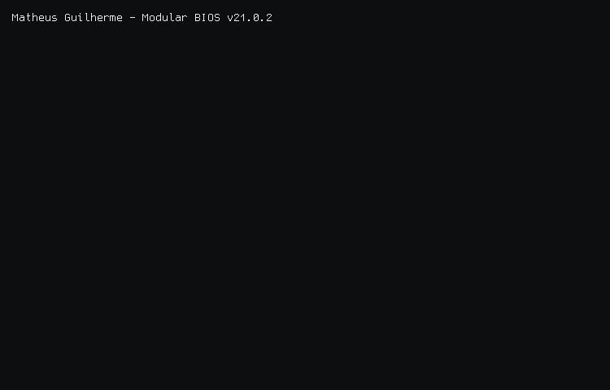
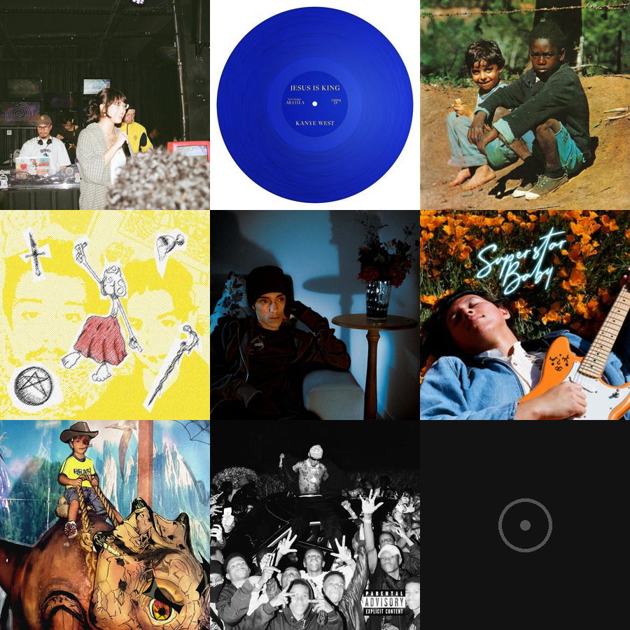

<!--START_SECTION:terminal-->
<picture>
    <source media="(prefers-color-scheme: dark)" srcset="./output.gif">
    <source media="(prefers-color-scheme: light)" srcset="./output.gif">
    
</picture>

 
<!--END_SECTION:terminal-->

Software Developer • API Developer • Full-Stack • Software Architecture

I build full-stack software and APIs, and I like working on the parts that make systems reliable as they grow: architecture, data boundaries, contracts, and tests.

* I'm a **Java and TypeScript developer**, currently mastering **Python and its ecosystem**.
* Software Engineering student at [PUC Minas](https://www.pucminas.br/).
* I work mainly with **Java + Spring Boot** on the backend and **TypeScript, React, and Astro** on the frontend.
* Interested in **API design, domain modeling, data isolation, automated testing, and software architecture**.
* Personal website: [theuzao.dev](https://theuzao.dev/)
* LinkedIn: [in/theuzao](https://www.linkedin.com/in/theuzao/)

### Tech Stack

<strong>Music</strong>

 

<table>
  <tr>
    <td align="center" valign="top">
      <strong>Top Albums · Last 12 Months</strong>  
      
    </td>
    <td align="center" valign="top">
      <strong>Recently Played</strong>  
      
    </td>
  </tr>
</table>

